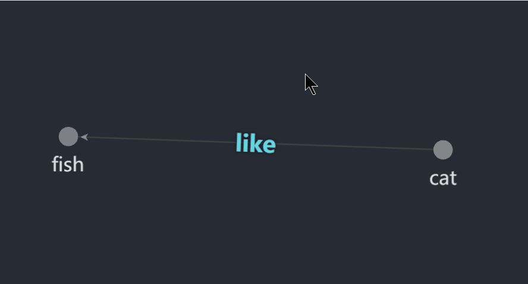
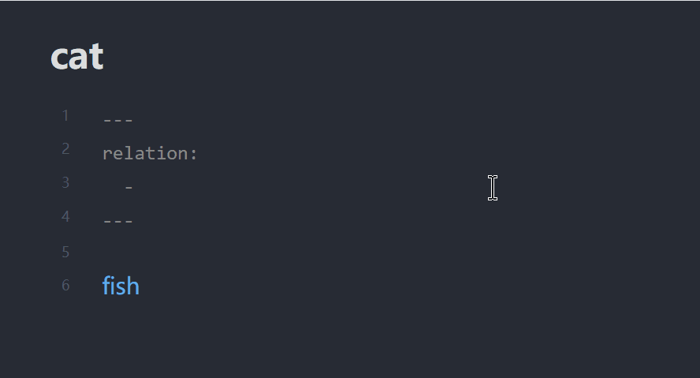

# Graph Edge Notes

Graph Edge Notes is an Obsidian plugin that overlays short relationship labels on graph-view edges.

## Demo

### Graph view



### Frontmatter setup



## What it does

- Reads note-to-note relations from frontmatter.
- Renders each relation label on the matching graph edge.
- Shows optional detail text when you hover a label.
- Adds a command to create a new relation for the current note.
- Supports a plugin-level default label color.
- Includes an optional debug panel that shows recent plugin actions and the current graph binding state.
- When debug mode is enabled, the plugin also writes recent debug events to `.obsidian/plugins/graph-edge-notes/debug.log` and removes that file again when debug mode is turned off.

## Frontmatter format

```yaml
relations:
  - '("limited-open")[[Open]]("finite-population open model")'
  - '("gossip")[[Communication]]'
```

The command palette editor currently saves relations in the string form above.

Object-style YAML is also accepted when reading existing notes:

```yaml
relation:
  - target: "[[Open]]"
    label: "limited-open"
    detail: "finite-population open model"
```

`label` is what appears on the edge. `detail` is optional and appears in the hover tooltip.

The frontmatter property name is configurable in plugin settings. In the examples above, `relations` and `relation` are both valid if your plugin setting is configured to match that property name.

## Important limitation

The plugin annotates edges that already exist in Obsidian's graph. It does not create new graph edges by itself. In practice, this means the two notes still need to be linked somewhere in the vault for an edge to appear.

Rendered labels show relation detail on hover. Edit relations through the command palette command **Add graph relation to current note** or by editing frontmatter directly.

## Development

```bash
npm install
npm run build
```

To test in a vault, copy `main.js`, `manifest.json`, and `styles.css` into:

```text
<Vault>/.obsidian/plugins/graph-edge-notes/
```

Then reload Obsidian and enable **Graph Edge Notes** under **Settings -> Community plugins**.
